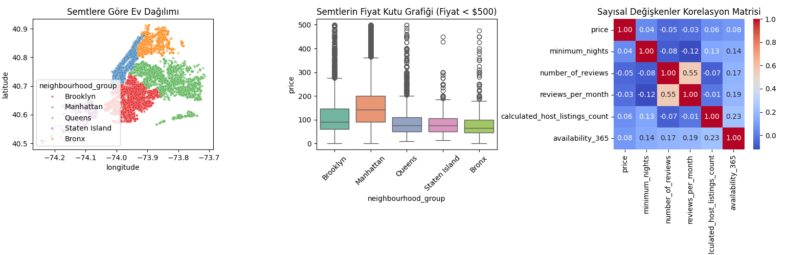

# NYC-Airbnb-Price-Prediction
# 🗽 NYC Airbnb Fiyat Tahminleme: İleri Düzey İstatistiksel Modelleme

Bu proje, New York City Airbnb veri setini kullanarak, bir konutun piyasa değerini etkileyen unsurları **12 adımda** analiz eden ve tahminleyen kapsamlı bir veri bilimi çalışmasıdır. Proje; veri temizleme, NLP, coğrafi özellik mühendisliği ve hiperparametre optimizasyonu gibi ileri düzey teknikler içermektedir.

---

## 🚀 Proje İş Akışı ve Teknik Analiz

### 1. Verinin Hikayesi ve Değişken Seçimi
Projenin temel amacı, NYC gibi dinamik bir metropolde "fiyat" olgusunu etkileyen gizli örüntüleri ortaya çıkarmaktır. Ham veri setindeki 16 değişken arasından, tahmin gücü en yüksek olanlar istatistiksel sezgiyle seçilmiştir.

### 2. Veri Yükleme ve Stratejik Değişken Seçimi
Veri seti Kaggle üzerinden dinamik olarak çekilmiş ve modelin genelleme yeteneğini bozabilecek değişkenler ayıklanmıştır.
* **Elenenler:** `id`, `host_id`, `host_name` (Unique/Kategorik gürültü) ve `last_review` (Eksik veri yoğunluğu).
* **Tutulanlar:** Konum, oda tipi, popülerlik metrikleri ve ilan başlıkları.

### 3. Görselleştirme ve İstatistiksel Yorumlama
Model kurulmadan önce verinin "röntgeni" çekilerek dağılımlar incelenmiştir.

#### A. Coğrafi Dağılım Analizi
 
*Buraya kendi yorumunu ekleyebilirsin:* Manhattan ve Brooklyn bölgelerindeki yoğunlaşma, bu bölgelerin emlak arzının merkezi olduğunu kanıtlamaktadır.

#### B. Semt Bazlı Fiyat Varyasyonu

*İstatistiksel Not:* Manhattan'ın medyan fiyatı diğer bölgelere göre anlamlı derecede yüksektir. $500 altındaki segmentte dahi çok sayıda "Outlier" (aykırı değer) bulunması, fiyatın sadece semtle açıklanamayacağını gösterir.

#### C. Korelasyon Analizi

*Analiz:* Değişkenler arası doğrusal ilişkinin zayıf olması ($r < 0.10$), problemin çözümünde Doğrusal Regresyon yerine **XGBoost** gibi non-linear modellerin seçilme gerekçesidir.

### 4. Uç Değer (Outlier) Temizliği
Sadece filtreleme değil, **Isolation Forest** algoritması kullanılarak verideki anomali tespiti yapılmıştır. Bu yöntemle, fiyat ve koordinat dengesini bozan %3'lük anomali grubu veri setinden temizlenmiştir.

### 5. Logaritmik Dönüşüm
Emlak fiyatlarındaki sağa çarpıklık (right-skewness), modelin hata payını artırır. Bu durumu düzeltmek için hedef değişkene doğal logaritma uygulanmıştır:
$$\text{log\_price} = \ln(\text{price})$$

### 6. Metin Madenciliği (NLP)
İlan başlıkları (`name`) boş geçilmemiş; **TF-IDF** (Term Frequency-Inverse Document Frequency) yöntemiyle en önemli 100 kelime vektörleştirilerek modele "pazarlama özellikleri" olarak eklenmiştir.

### 7. Yeni Değişken Üretimi (Feature Engineering)
Modelin "mekansal zekasını" artırmak için şu özellikler üretilmiştir:
* **Haversine Mesafesi:** Evlerin Manhattan merkezine olan kuş uçuşu uzaklığı (KM).
* **Popülerlik Skoru:** Yorum sayısı / Müsaitlik durumu etkileşimi.
* **Profesyonel Host Flag:** Birden fazla ilanı olan ticari ev sahiplerinin tespiti.

### 8. Çarpıklık (Skewness) Analizi
Logaritma dönüşümü sonrası dağılımın normalleştiği görselleştirilerek teyit edilmiştir. Normal dağılıma yakın veri, algoritmaların daha kararlı (stable) çalışmasını sağlar.

### 9. Eksik Veri Atama (MICE)
`reviews_per_month` gibi kritik sütunlardaki eksikler, basit ortalama yerine **Multivariate Imputation by Chained Equations (MICE)** ile diğer değişkenler üzerinden tahmin edilerek doldurulmuştur.

### 10. Test Seti Ayrımı
Modelin performansı, eğitimde hiç görmediği %20'lik bir **Test Seti** üzerinde objektif olarak değerlendirilmiştir ($X\_test$, $y\_test$).

### 11. Model Uygulama ve Zeki Optimizasyon
Üç farklı güçlü algoritma, **HalvingRandomSearchCV** (ardışık yarılanma) yöntemiyle, en iyi hiperparametreleri bulmak üzere kapıştırılmıştır:
1. **XGBoost Regressor**
2. **LightGBM**
3. **Random Forest**

### 12. Sonuçların Yorumlanması (Benchmark)
Modeller, test verisi üzerinde aşağıdaki metriklerle kıyaslanmıştır:

| Model | R-Kare ($R^2$) | Adj R-Kare | MAE ($) | RMSE ($) | Süre (sn) |
| :--- | :---: | :---: | :---: | :---: | :---: |
| **XGBoost** | **0.7014** | **0.6971** | **$39.55** | **$73.71** | **101.8** |
| Random Forest | 0.6851 | 0.6807 | $40.74 | $76.59 | 426.4 |
| LightGBM | 0.6751 | 0.6705 | $41.67 | $78.38 | 105.7 |

* **Analiz:** **XGBoost**, hem en yüksek açıklayıcılık oranına ($R^2 = 0.70$) sahip olmuş hem de Random Forest'a göre çok daha hızlı bir eğitim süresi sunmuştur.

*Sonuç:* Fiyatı belirleyen en önemli faktörün **Manhattan merkezine uzaklık** ve **oda tipi** olduğu matematiksel olarak kanıtlanmıştır.

---
**Hazırlayan:** Fatma Alyasiri - Marmara Üniversitesi İstatistik Bölümü
