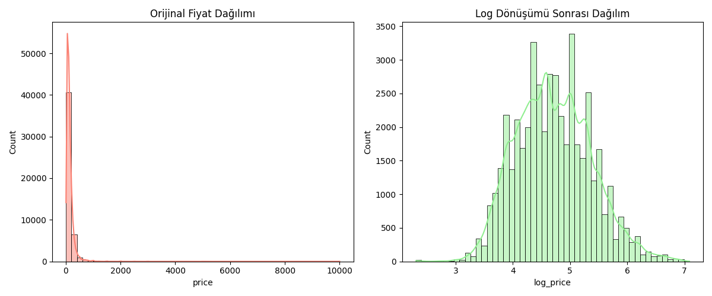
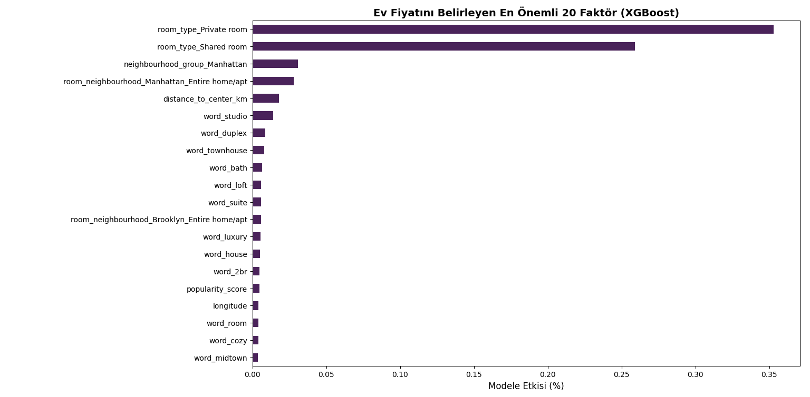
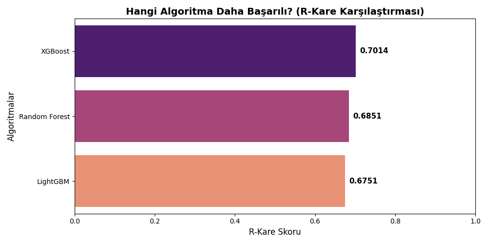

# NYC-Airbnb-Price-Prediction
# 🗽 NYC Airbnb Fiyat Tahminleme

Bu proje, New York City Airbnb veri setini kullanarak, bir konutun piyasa değerini etkileyen unsurları **12 adımda** analiz eden ve tahminleyen kapsamlı bir veri bilimi çalışmasıdır. Proje; veri temizleme, NLP, coğrafi özellik mühendisliği ve hiperparametre optimizasyonu gibi ileri düzey teknikler içermektedir.

---

## 🚀 Proje İş Akışı ve Teknik Analiz

### 1. Verinin Hikayesi ve Değişken Seçimi
Projenin temel amacı, NYC gibi dinamik bir metropolde "fiyat" olgusunu etkileyen gizli örüntüleri ortaya çıkarmaktır. Ham veri setindeki 16 değişken arasından, tahmin gücü en yüksek olanlar istatistiksel sezgiyle seçilmiştir.

### 2. Veri Yükleme ve Stratejik Değişken Seçimi
Veri seti Kaggle üzerinden dinamik olarak çekilmiş ve modelin genelleme yeteneğini bozabilecek değişkenler ayıklanmıştır.
* **Elenenler:** `id`, `host_id`, `host_name` (Unique/Kategorik gürültü) ve `last_review` (Eksik veri yoğunluğu).
* **Tutulanlar:** Konum, oda tipi, popülerlik metrikleri ve ilan başlıkları.

### 3. Görselleştirme ve İstatistiksel Yorumlama
Model kurulmadan önce verinin "röntgeni" çekilerek dağılımlar incelenmiştir.

  

#### A. Coğrafi Dağılım Analizi
*Analiz:* Manhattan ve Brooklyn bölgelerindeki yoğunlaşma, bu bölgelerin emlak arzının merkezi olduğunu kanıtlamaktadır.

#### B. Semt Bazlı Fiyat Varyasyonu
*İstatistiksel Not:* Manhattan'ın medyan fiyatı diğer bölgelere göre anlamlı derecede yüksektir. $500 altındaki segmentte dahi çok sayıda "Outlier" (aykırı değer) bulunması, fiyatın sadece semtle açıklanamayacağını gösterir.

#### C. Korelasyon Analizi
*Analiz:* Değişkenler arası doğrusal ilişkinin zayıf olması ($r < 0.10$), problemin çözümünde Doğrusal Regresyon yerine **XGBoost** gibi non-linear modellerin seçilme gerekçesidir.

### 4. Uç Değer (Outlier) Temizliği
Sadece filtreleme değil, **Isolation Forest** algoritması kullanılarak verideki anomali tespiti yapılmıştır. Bu yöntemle, fiyat ve koordinat dengesini bozan %3'lük anomali grubu veri setinden temizlenmiştir.

### 5. Logaritmik Dönüşüm
Emlak fiyatlarındaki sağa çarpıklık (right-skewness), modelin hata payını artırır. Bu durumu düzeltmek için hedef değişkene doğal logaritma uygulanmıştır:

  $$\text{log\_price} = \ln(\text{price})$$

### 6. Metin Madenciliği (NLP)
İlan başlıkları (`name`) boş geçilmemiş; **TF-IDF** (Term Frequency-Inverse Document Frequency) yöntemiyle en önemli 100 kelime vektörleştirilerek modele "pazarlama özellikleri" olarak eklenmiştir.

### 7. Yeni Değişken Üretimi (Feature Engineering)

Modelin "mekansal zekasını" artırmak için şu özellikler üretilmiştir:
* **Haversine Mesafesi (Manhattan Proximity):**
    Koordinat verileri (`latitude`, `longitude`) ağaç tabanlı modeller için tek başlarına sınırlı anlam ifade eder. Haversine formülü kullanılarak, her ilanın Manhattan merkezine (Empire State: 40.7488, -73.9854) olan kuş uçuşu uzaklığı (KM) hesaplanmıştır. Gayrimenkul değerlemesinde "merkeze yakınlık" en kritik fiyat belirleyicilerinden biridir.

* **Oda ve Semt Etkileşimi (Room-Neighbourhood Interaction):**
    İlanın bulunduğu semt (`neighbourhood_group`) ve oda türü (`room_type`) arasındaki çapraz etkileşimi yakalamak için iki değişken birleştirilmiştir. Örneğin; Manhattan'daki bir "Özel Oda" ile Bronx'taki bir "Özel Oda" arasındaki fiyat makası bu değişken sayesinde model tarafından daha net ayırt edilebilir.

* **Konaklama Süresi Kategorizasyonu (Stay Binning):**
    `minimum_nights` değişkenindeki aşırı uç değerlerin (outliers) yarattığı gürültüyü azaltmak adına veriler kategorize edilmiştir. Konaklama süreleri; 3 güne kadar "Kısa Dönem", 14 güne kadar "Orta Dönem" ve daha fazlası "Uzun Dönem" olarak sınıflandırılmış, böylece ilanların kullanım amacı (turistik vs. yerleşik) modele öğretilmiştir.

* **Göreceli Popülerlik Skoru (Popularity Score):**
    Sosyal kanıt (social proof) metriklerini anlamlandırmak için, toplam yorum sayısı (`number_of_reviews`) evin yıl içindeki müsaitlik durumuna (`availability_365`) oranlanmıştır. Az bulunan ama çok yorum alan evler, arz-talep dengesinde "yüksek talep" olarak işaretlenmiştir.

* **Profesyonel Ev Sahibi Ayrımı (Is Pro Host):**
    Platformdaki toplam ilan sayısına (`calculated_host_listings_count`) bakılarak, 1'den fazla evi olan kullanıcılar "Profesyonel Ev Sahibi" (Binary: 1) olarak işaretlenmiştir. Ticari işletmelerin fiyatlandırma stratejileri ile bireysel kullanıcıların stratejileri arasındaki fark modele bu bayrak (flag) üzerinden aktarılmıştır.

* **Yorum Yoğunluğu ve Talep Hızı (Review Density):**
    İlanın güncel etkileşim hızını ölçmek için, aylık yorum alma hızı (`reviews_per_month`), toplam yorum sayısına oranlanmıştır. Bu oran, ilanın ne kadar süredir aktif olduğunu ve son dönemdeki popülerliğini yansıtan bir yoğunluk metriği sunar.

### 8. Çarpıklık (Skewness) Analizi

  

Logaritma dönüşümü sonrası dağılımın normalleştiği görselleştirilerek teyit edilmiştir. Normal dağılıma yakın veri, algoritmaların daha kararlı (stable) çalışmasını sağlar.

### 9. Eksik Veri Atama (MICE)
`reviews_per_month` gibi kritik sütunlardaki eksikler, basit ortalama yerine **Multivariate Imputation by Chained Equations (MICE)** ile diğer değişkenler üzerinden tahmin edilerek doldurulmuştur.

### 10. Test Seti Ayrımı
Modelin performansı, eğitimde hiç görmediği %20'lik bir **Test Seti** üzerinde objektif olarak değerlendirilmiştir ($X\_test$, $y\_test$).

### 11. Model Uygulama ve Zeki Optimizasyon
Üç farklı güçlü algoritma, **HalvingRandomSearchCV** (ardışık yarılanma) yöntemiyle, en iyi hiperparametreleri bulmak üzere kapıştırılmıştır:
1. **XGBoost Regressor**
2. **LightGBM**
3. **Random Forest**

### 12. Sonuçların Yorumlanması (Benchmark)
Modeller, test verisi üzerinde aşağıdaki metriklerle kıyaslanmıştır:

| Model | R-Kare ($R^2$) | Adj R-Kare | MAE ($) | RMSE ($) | Süre (sn) |
| :--- | :---: | :---: | :---: | :---: | :---: |
| **XGBoost** | **0.7014** | **0.6971** | **$39.55** | **$73.71** | **101.8** |
| Random Forest | 0.6851 | 0.6807 | $40.74 | $76.59 | 426.4 |
| LightGBM | 0.6751 | 0.6705 | $41.67 | $78.38 | 105.7 |

  
  

*Sonuç:* Fiyatı belirleyen en önemli faktörün **Manhattan merkezine uzaklık** ve **oda tipi** olduğu matematiksel olarak kanıtlanmıştır.
* **Analiz:** **XGBoost**, hem en yüksek açıklayıcılık oranına ($R^2 = 0.70$) sahip olmuş hem de Random Forest'a göre çok daha hızlı bir eğitim süresi sunmuştur.

---
**Hazırlayan:** Fatma Alyasiri - Marmara Üniversitesi İstatistik Bölümü
